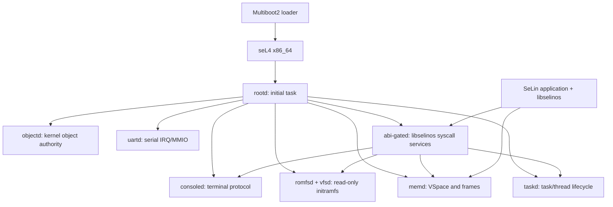

# SeLinOS: архитектура стартовой многосерверной ОС на seL4

**Статус:** проектная спецификация v0.1  
**Целевая платформа:** x86_64 PC99, сначала QEMU  
**Базовое микроядро:** seL4, без Linux-ядра, Linux VM и Linux Kernel Library  
**Автор:** Manus AI  
**Дата:** 13 августа 2026

## 1. Цель и честная граница совместимости

SeLinOS — новая многосерверная ОС, построенная поверх одного экземпляра seL4. Микроядро оставляет в привилегированном режиме механизмы планирования, виртуальной памяти, IPC, прерываний и capabilities. Все высокоуровневые функции ОС — процессы, виртуальная память пользовательских задач, файловые объекты, консоль, ABI-переходник и впоследствии сеть — работают как независимые пользовательские домены.

> **Цель проекта — эволюционно реализуемый Linux x86_64 ABI-слой без Linux-ядра.** Первый исполняемый этап обеспечивает нативную POSIX-подсистему для программ, собранных под SeLinOS с `libselinos`. Он не обещает немедленный запуск произвольного, непересобранного Linux ELF, `apt` или всех Debian-пакетов.

Эта граница обязательна из-за архитектуры x86_64: существующий Linux ELF выполняет инструкцию `syscall`, которую процессор передаёт в привилегированный обработчик seL4. Обычный пользовательский IPC-сервер не может самостоятельно перехватить её. Непересобранная бинарная совместимость потребует позднего отдельного решения: instrumentation/транслятора или opt-in Linux-personality расширения диспетчера seL4; последний вариант меняет микроядро и потребует новой верификации соответствующей конфигурации.[1] [2]

## 2. Модель изоляции

Каждый исполняемый домен SeLinOS имеет отдельный **TCB**, корневой **CSpace** и отдельный корневой **VSpace**. Это сильнее обычной модели POSIX-потоков: виртуальная память и полномочия не разделяются неявно. Общие страницы допускаются только как явно созданные и выданные frame capabilities. Каждый домен также получает отдельный IPC buffer и endpoint для faults.

| Свойство | Механизм seL4 | Политика SeLinOS v0.1 |
|---|---|---|
| Контекст выполнения | TCB | Один TCB на один исполнительный домен; нет общего TCB |
| Память | VSpace + frame caps | Отдельный root VSpace; shared memory только `memd` по краткоживущему договору |
| Права | CSpace / CNode | Empty-by-default: нет capability — нет доступа |
| Обмен | Endpoint + IPC / Notification | Только по зарегистрированному протоколу сервиса |
| Сбой страницы | fault endpoint | Направляется `memd`; ответом является mapping или завершение домена |
| Прерывания | IRQ capability | Доступ только `uartd`/будущим драйверным доменам |
| Жизненный цикл | TCB authority | Создание и уничтожение только `taskd` через `objectd` |

TCB содержит приоритет, регистры, CSpace, VSpace, endpoint faults и reply slot; CSpace — полный диапазон capabilities, доступных потоку.[3] [4] Поэтому разделение реализуется не проверками «кто ты?» в каждом сервере, а отсутствием прав на объект в CSpace вызывающего.

## 3. Компоненты первого запуска

| Компонент | Привилегии | Ответственность | Не имеет права |
|---|---|---|---|
| `rootd` | Начальный BootInfo и bootstrap caps | Создаёт доверенные службы, затем удаляет лишние capabilities | Не обслуживает прикладные syscall напрямую |
| `objectd` | Делегированные untyped caps, возможность retype kernel objects | Выдаёт TCB/CNode/endpoint/frame по запросу доверенных менеджеров | Не имеет доступа к пользовательским данным/диску |
| `taskd` | Controlled caps к TCB/CNode task domains | Идентичности PID/TID, запуск/остановка, создание domain | Не маппит файловый storage и не получает IRQ |
| `memd` | VSpace root caps, mapping authority, frames | Частная память, stack, IPC buffer, безопасный shared frame | Не выполняет файловые/терминальные операции |
| `romfsd` | Read-only initramfs frame caps | Чтение начальных ELF/конфигурации | Не создаёт TCB и не маппит чужую память |
| `vfsd` | Ссылки на файловые объекты | Имена, file handles, `openat`/`close`/`fstat` MVP | Нет IRQ и TCB control caps |
| `uartd` | Только UART MMIO и IRQ caps | Аппаратный последовательный I/O, уведомления | Нет файла, TCB и VSpace клиента |
| `consoled` | Endpoint к `uartd` | Потоковый stdin/stdout/stderr protocol | Нет MMIO/IRQ и управления задачами |
| `abi-gated` | Только client ABI endpoints и service endpoints | Синтаксис ABI, pointer validation, FD table, маршрутизация | Нет untyped, IRQControl, TCB control и device frames |
| app domain | Свой TCB/CSpace/VSpace, service caps | Запуск прикладного кода | Не получает capabilities чужих доменов |

`rootd` и `objectd` входят в начальную доверенную вычислительную базу. После загрузки rootd обязан уничтожить или не передавать избыточные copies caps; иначе архитектурная изоляция станет декларативной.

## 4. IPC-протокол

Все вызовы между пользовательскими доменами используют фиксированный заголовок из machine words. Большие данные не передаются пользовательским указателем серверу напрямую: для них `memd` создаёт nonce-bound shared frame, маппит его ровно вызывающей и обслуживающей стороне, а `abi-gated` отзывает mapping после ответа.

| Поле | Размер | Смысл |
|---|---:|---|
| `opcode` | 32-bit | Номер операции в пространстве конкретного endpoint |
| `flags` | 32-bit | Режим, права, короткие параметры |
| `request_id` | 64-bit | Защита от спутывания/повторного ответа |
| `arg[0..3]` | 64-bit each | Малые скалярные аргументы |
| `cap[0..n]` | seL4 IPC extra caps | Только передаваемые object/frame/endpoint capabilities |
| `shared_ref` | 64-bit | Идентификатор временного frame; не raw pointer |

### 4.1 Правила безопасности IPC

Сервер обязан проверять `opcode`, размеры, флаги, права переданной capability и связность `request_id`. Запрос с некорректным форматом завершается `-EINVAL`; capability без нужного права — `-EPERM`; исчерпание памяти — `-ENOMEM`. Сырые адреса из адресного пространства клиента никогда не разыменовываются сервером.

### 4.2 Ключевые протоколы

| Endpoint | Операции MVP | Возвращает |
|---|---|---|
| `taskd` | `TASK_CREATE`, `TASK_EXIT`, `TASK_QUERY_IDS` | PID/TID, status, task endpoint cap |
| `memd` | `MEM_ALLOC`, `MEM_MAP`, `MEM_UNMAP`, `MEM_BRK`, `MEM_SHARE_TEMP` | frame/map response или `-errno` |
| `vfsd` | `VFS_OPENAT`, `VFS_CLOSE`, `VFS_FSTAT`, `VFS_SEEK` | capability-backed file object / metadata |
| `consoled` | `CON_WRITE`, `CON_READ` | байты или `-errno` |
| `abi-gated` | `ABI_CALL`, `ABI_REGISTER_THREAD`, `ABI_EXIT` | Linux raw return convention (`-errno`) |

## 5. Начальный Linux/POSIX ABI-контракт

`libselinos` является thin user-space ABI library. На первом этапе она предоставляет C/POSIX-обёртки и вызывает `abi-gated` через seL4 IPC. Это не glibc и не использует Linux kernel. Для каждого вызова library возвращает обычный C-результат, выставляя `errno`; внутри IPC raw-результат имеет Linux-подобное значение: неотрицательное — успех, отрицательное — `-errno`.

| Группа | Вызовы ABI v0.1 | Маршрут | Статус |
|---|---|---|---|
| Завершение | `exit`, `exit_group` | `abi-gated → taskd` | Первый запуск |
| Консоль | `write` для fd 1/2, ограниченный `read` fd 0 | `abi-gated → consoled → uartd` | Первый запуск |
| Идентичность | `getpid`, `gettid` | `abi-gated → taskd` | Первый запуск |
| Время | `clock_gettime`, `nanosleep` | `abi-gated → timer service` | После UART |
| Память | `brk`, anonymous `mmap`, `munmap` | `abi-gated → memd` | После базового `write` |
| Файлы | `openat`, `close`, `fstat`, `lseek`, read-only `read` | `abi-gated → vfsd → romfsd` | После initramfs |
| Потоки | ограниченный `clone` с новым TCB/VSpace/CSpace | `abi-gated → taskd + memd` | Вторая итерация |
| Синхронизация | локальный `futex` | `abi-gated` / notification | Вторая итерация |
| Иное | все остальные номера | — | `-ENOSYS` |

Приложения, которым нужна типичная Linux shared-address-space pthread-модель, пока не поддерживаются: новый домен всегда получает отдельный VSpace/CSpace. Впоследствии совместимые shared mappings могут быть введены строго через `memd`, но это не будет неявным общим адресным пространством.

## 6. Формат ошибок и file descriptors

Внешний POSIX API использует `-1` и `errno`, как ожидают C-программы. Внутренний ABI response использует raw `-errno`, чтобы не терять значение между сервисами. FD — положительное целое, отображаемое в per-domain descriptor table на ограниченную capability файла/консоли; пользователь не может сфабриковать endpoint, просто подставив номер FD.

| FD первого запуска | Объект | Права |
|---:|---|---|
| 0 | console input capability | `read` |
| 1 | console output capability | `write` |
| 2 | console error capability | `write` |

## 7. Загрузка и жизненный цикл

1. Multiboot2 loader запускает `seL4` и `rootd` на x86_64/QEMU.
2. `rootd` читает BootInfo, создаёт `objectd`, `memd`, `taskd`, `uartd`, `consoled`, `romfsd`, `vfsd` и `abi-gated`.
3. Каждый сервер получает отдельные TCB/CSpace/VSpace и только нужные endpoint/frame/device caps.
4. `rootd` запускает `init`, статически собранный с `libselinos`.
5. `init` выполняет `write(1, "SeLinOS...", ...)`; `abi-gated` направляет его в console path.
6. Успех минимальной вехи — наблюдаемая строка в QEMU serial console и debug report, подтверждающий, что все домены существуют в раздельных TCB/CSpace/VSpace.

## 8. Тесты и критерии приёмки

| Проверка | Критерий |
|---|---|
| Изоляция capabilities | application CSpace не содержит `IRQControl`, untyped, чужих TCB/VSpace/control endpoints |
| Изоляция памяти | попытка обратиться к немаппленному адресу создаёт fault; `memd` завершает или безопасно отклоняет домен |
| IPC | `init → abi-gated → consoled → uartd` печатает точную тестовую строку |
| Модель потоков | второй app domain создаёт отдельный TCB, CSpace и VSpace; не читает память первого |
| Обработка ошибок | неподдержанный ABI opcode/syscall возвращает `-ENOSYS`; неуспешный cap request возвращает `-EPERM` |
| Воспроизводимость | точно закреплённые версии seL4, toolchain и QEMU; чистая сборка на Ubuntu 24.04 |

## 9. Дорожная карта совместимости

| Веха | Результат | Не включает |
|---|---|---|
| M0 | seL4 boots, isolated services, serial hello | Linux binaries, filesystem |
| M1 | `libselinos`: console, PID/TID, exit, anonymous memory | dynamic linker, `fork`, `apt` |
| M2 | read-only initramfs VFS и статические программы под SeLinOS | Debian packages |
| M3 | executable ELF loader, process lifecycle, `clone`, futex | full pthread/glibc semantics |
| M4 | writable VFS, process permissions, pipes/PTY, sockets | general distro compatibility |
| M5 | dynamic linker, broad syscall suite, package manager port | promise of every external Linux package |
| M6 | experimental raw Linux ELF personality via isolated binary translation or separately verified seL4 extension | automatic proof of full Linux compatibility |

## 10. Безопасность и верификация

seL4 имеет доказательства для конкретных конфигураций ядра, но они не автоматически доказывают безопасность `rootd`, `objectd`, `abi-gated`, драйверов, файловой системы, Linux ABI or future package manager. SeLinOS не заявляет «полную формальную верификацию ОС» до тех пор, пока не будет отдельно доказан и/или тщательно проверен весь user-space TCB. Никакое изменение исходного seL4 не будет вноситься в MVP.

## References

[1] [Linux `syscalls(2)` — man7.org](https://man7.org/linux/man-pages/man2/syscalls.2.html)  
[2] [Linux `syscall(2)` — man7.org](https://man7.org/linux/man-pages/man2/syscall.2.html)  
[3] [Threads — seL4 Docs](https://docs.sel4.systems/Tutorials/threads.html)  
[4] [Capabilities — seL4 Docs](https://docs.sel4.systems/Tutorials/capabilities.html)  
[5] [seL4 x86_64 trap source](https://raw.githubusercontent.com/seL4/seL4/master/src/arch/x86/64/c_traps.c)  
[6] [seL4 API reference](https://docs.sel4.systems/projects/sel4/api-doc.html)
